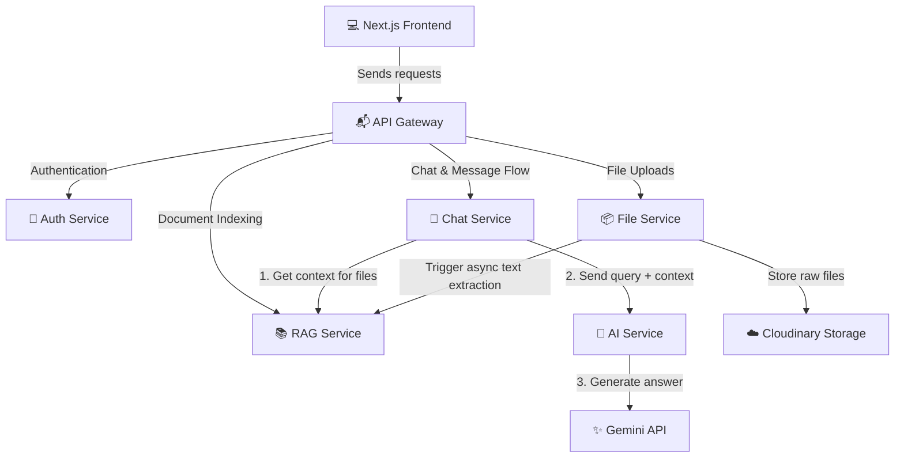

# 🤖 Gemini AI Chatbot Assistant (Enterprise Microservices)

A professional, decoupled AI Chatbot workspace powered by **Google Gemini 3.6 Flash** and **Retrieval-Augmented Generation (RAG)**. This application lets users upload files (PDFs, Word docs, text files, and images) and chat directly with their contents in real-time.

---

## 🎯 Project Motive (Why we built this?)

Usually, simple AI chatbots can only answer general questions. When you want them to analyze your personal or business files (like reports, notes, or scanned images), they run out of memory or lose context. 

This project was built to solve this problem by combining two modern software paradigms:
1. **Microservices Architecture:** Instead of building one giant, heavy application, we broke it into **6 independent mini-services**. If the file processing service is busy, the chat or login services remain fast and unaffected.
2. **Retrieval-Augmented Generation (RAG):** When you upload a file, our system reads it, slices it into readable parts, and saves it in a vector database. When you ask a question, the system acts like a smart librarian—it quickly fetches only the relevant pages of your document and feeds them to Gemini to give you an accurate, context-aware answer.

---

## ✨ Key Features

* 🔐 **Secure Auth:** JWT-based user login and registration with encrypted passwords.
* 📁 **Multi-Format File Support:** Upload PDFs, Word Documents (`.docx`), Plain Text, and Images.
* 👁️ **Gemini OCR (Vision):** Upload an image, and Gemini will automatically read the text inside it to answer your questions.
* 🧠 **Smart Context Retrieval (RAG):** Uses vector similarity search to retrieve relevant pages of your files.
* ⚡ **Robust Database Fallback:** Uses MongoDB Atlas Vector Search, with a built-in mathematical cosine-similarity fallback to ensure it works on any MongoDB connection without complex setup.
* ☁️ **Cloud Storage:** Stores all files securely in **Cloudinary** so they load instantly.

---

## 🧩 Microservices: A Simple Breakdown

Here is how the services work together in simple terms:

* **1. Frontend (The Face 💻):** The Next.js website where users login and send messages.
* **2. API Gateway (The Postman 📬):** The single entry point. It receives all frontend requests and directs them to the correct microservice.
* **3. Auth Service (The Security Guard 🔐):** Checks user passwords and creates secure login sessions (tokens).
* **4. File Service (The Warehouse Manager 📦):** Receives your uploaded files, stores them safely in Cloudinary cloud storage, and saves their details.
* **5. RAG Service (The Librarian 📚):** Reads your uploaded documents, chops them into small snippets, converts them into numeric vector mathematical formats (embeddings), and searches for relevant snippets when you ask a question.
* **6. AI Service (The Brain 🧠):** Talks to Google's Gemini API to generate smart responses using the snippets provided by the RAG Service.

---

## 🏗️ System Flow (Visual Representation)



---

## 🛠️ Technology & Tools Used

| Service | Technology | Purpose |
| :--- | :--- | :--- |
| **Frontend** | Next.js, React, Tailwind CSS | High-performance, responsive UI |
| **API Gateway** | Express, `http-proxy-middleware` | Route forwarding |
| **Auth Service** | Express, JWT, `bcryptjs` | User authentication & password hashing |
| **Chat Service** | Express, MongoDB | Saves messages and conversations |
| **File Service** | Multer, Cloudinary SDK | Cloud storage integration |
| **RAG Service** | `pdf-parse`, `mammoth`, `@google/genai` | Document parsing & text-embeddings generation |
| **AI Service** | `@google/genai` (Gemini-3.6-flash) | Generates AI responses |
| **Database** | MongoDB Atlas | Stores user data, messages, and vector embeddings |

---

## 📡 Core API Routes

* **API Gateway (`Port 4000`):** Access all endpoints through `http://localhost:4000/api`
* **Auth Service (`Port 4001`):** `/api/auth/register`, `/api/auth/login`, `/api/auth/me`
* **Chat Service (`Port 4002`):** `/api/chat/conversations` (manage chats), `/api/chat/messages/:conversationId` (send/receive messages)
* **File Service (`Port 4004`):** `/api/files/upload` (upload file), `/api/files/` (list/delete files)
* **RAG Service (`Port 4005`):** `/api/rag/process` (index text), `/api/rag/query` (query vector database)

---

## 🚀 How to Run Locally

### Prerequisites
* Install Node.js (v18+)
* A MongoDB connection URI.
* A Gemini API key.
* A Cloudinary free account.

### Step 1: Configure Environment Variables

1. **Frontend (`frontend/.env.local`):**
   ```env
   NEXT_PUBLIC_API_URL=http://localhost:4000/api
   ```
2. **API Gateway (`services/api-gateway/.env`):**
   ```env
   PORT=4000
   AUTH_SERVICE_URL=http://localhost:4001
   CHAT_SERVICE_URL=http://localhost:4002
   AI_SERVICE_URL=http://localhost:4003
   FILE_SERVICE_URL=http://localhost:4004
   RAG_SERVICE_URL=http://localhost:4005
   ```
3. **Backend Services (`services/<service-name>/.env`):**
   Create a `.env` in each service folder with:
   - `PORT` (e.g. 4001 for Auth, 4002 for Chat, 4003 for AI, 4004 for File, 4005 for RAG)
   - `MONGO_URI`
   - `JWT_SECRET`
   - `GEMINI_API_KEY` (Required in `ai-service` & `rag-service`)
   - `CLOUDINARY_CLOUD_NAME`, `CLOUDINARY_API_KEY`, `CLOUDINARY_API_SECRET` (Required in `file-service`)

### Step 2: Install & Start Services

Open separate terminals for each folder:
```bash
# In each of: services/api-gateway, services/auth-service, services/chat-service, 
# services/ai-service, services/file-service, services/rag-service, and frontend:
npm install
npm run dev
```

---

## ⚡ Prevent Hosted Service Sleep Timeouts

On Render's Free tier, microservices spin down (go to sleep) after 15 minutes of inactivity. When a user tries to access the chatbot, this causes a cold start delay.

To keep them running 24/7 for free:
1. Run our local keep-alive script:
   ```bash
   node keep-alive.js
   ```
2. Or configure a free uptime ping monitor at [UptimeRobot](https://uptimerobot.com/) pointing to the `/health` endpoint of each service listed in `keep-alive.js`.
